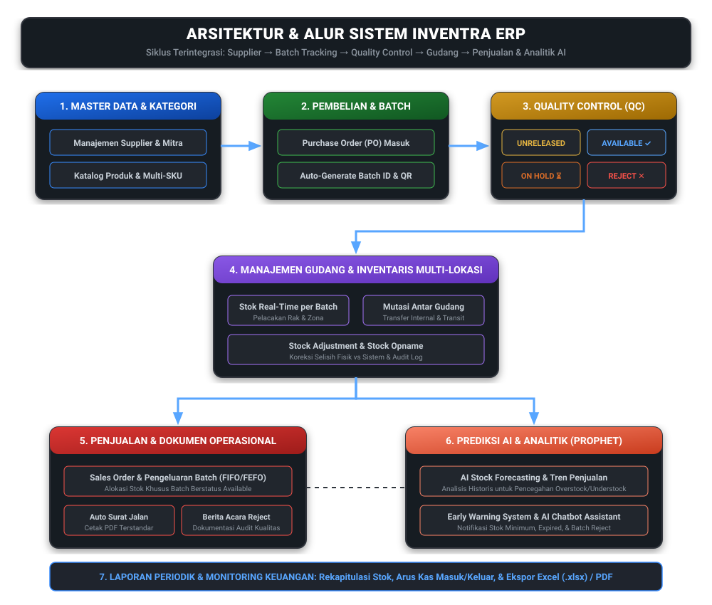

# Inventra — Manajemen Inventaris & ERP Distributor Modern

<div align="center">


**Platform Sistem Manajemen Inventaris, Batch Tracking, & Proyeksi Stok Berbasis AI untuk Perusahaan Distribusi dan UMKM di Indonesia**

</div>

---

## 📑 Table of Contents (Daftar Isi)

- [BAB I — Pendahuluan (Non-Teknis)](#bab-i---pendahuluan-non-teknis)
  - [1.1 Latar Belakang](#11-latar-belakang)
  - [1.2 Problem Statement](#12-problem-statement)
  - [1.3 Rumusan Masalah (Research Question)](#13-rumusan-masalah-research-question)
  - [1.4 Mengapa Proyek Ini Dibuat (Why This Project)](#14-mengapa-proyek-ini-dibuat-why-this-project)
- [BAB II — Tentang Inventra (Non-Teknis)](#bab-ii---tentang-inventra-non-teknis)
  - [2.1 Deskripsi Produk & Fungsi Utama](#21-deskripsi-produk--fungsi-utama)
  - [2.2 Masalah yang Diselesaikan](#22-masalah-yang-diselesaikan)
  - [2.3 Fitur Utama](#23-fitur-utama)
- [BAB III — Alur Sistem & Proses Bisnis (Semi-Teknis)](#bab-iii---alur-sistem--proses-bisnis-semi-teknis)
  - [3.1 Gambaran Umum Alur](#31-gambaran-umum-alur)
  - [3.2 Diagram Alur Sistem](#32-diagram-alur-sistem)
  - [3.3 Manajemen Status Barang (Batch Status Lifecycle)](#33-manajemen-status-barang-batch-status-lifecycle)
- [BAB IV — Role & Hak Akses Pengguna (Semi-Teknis)](#bab-iv---role--hak-akses-pengguna-semi-teknis)
  - [4.1 Daftar Role](#41-daftar-role)
  - [4.2 Matriks Hak Akses (Role Permission Matrix)](#42-matriks-hak-akses-role-permission-matrix)
  - [4.3 Kustomisasi Role Mandiri (Self-Service RBAC)](#43-kustomisasi-role-mandiri-self-service-rbac)
- [BAB V — Arsitektur Teknis (Teknis)](#bab-v---arsitektur-teknis-teknis)
  - [5.1 Gambaran Arsitektur](#51-gambaran-arsitektur)
  - [5.2 Tech Stack](#52-tech-stack)
  - [5.3 Struktur Direktori Repository](#53-struktur-direktori-repository)
- [BAB VI — Instalasi & Menjalankan Aplikasi (Teknis)](#bab-vi---instalasi--menjalankan-aplikasi-teknis)
  - [6.1 Prasyarat](#61-prasyarat)
  - [6.2 Langkah Instalasi & Deployment Local](#62-langkah-instalasi--deployment-local)
  - [6.3 Endpoint Layanan Setelah Berjalan](#63-endpoint-layanan-setelah-berjalan)
  - [6.4 Menghentikan Layanan](#64-menghentikan-layanan)
  - [6.5 Kredensial Demo](#65-kredensial-demo)
  - [6.6 Referensi Dokumentasi API](#66-referensi-dokumentasi-api)
- [BAB VII — Studi Kasus (Non-Teknis)](#bab-vii---studi-kasus-non-teknis)
  - [7.1 Profil Perusahaan](#71-profil-perusahaan)
  - [7.2 Masalah yang Dihadapi Sebelum Implementasi](#72-masalah-yang-dihadapi-sebelum-implementasi)
  - [7.3 Bagaimana Inventra Menyelesaikannya](#73-bagaimana-inventra-menyelesaikannya)
- [BAB VIII — Rencana Pengembangan / Roadmap (Non-Teknis)](#bab-viii---rencana-pengembangan--roadmap-non-teknis)
- [BAB IX — Lisensi & Kontribusi (Teknis)](#bab-ix---lisensi--kontribusi-teknis)
  - [9.1 Lisensi](#91-lisensi)
  - [9.2 Panduan Kontribusi](#92-panduan-kontribusi)

---

## BAB I — Pendahuluan (Non-Teknis)

### 1.1 Latar Belakang
Perusahaan di sektor manufaktur dan distribusi skala menengah ke atas di Indonesia masih banyak yang mengandalkan lembar kerja (*spreadsheet*) atau pencatatan manual dalam mengelola inventaris gudang. Pendekatan konvensional ini semakin tidak efektif seiring meningkatnya jumlah SKU (*Stock Keeping Unit*) dan tingginya frekuensi transaksi, sehingga mengakibatkan kurangnya visibilitas stok secara *real-time* dan ketidakmampuan melacak pergerakan barang secara spesifik hingga ke tingkat batch pengiriman.

Selain itu, hubungan operasional antara divisi manufaktur dan distribusi kerap terhambat oleh ketidaksinkronan data inventaris. Ketidaksinkronan ini tidak hanya memicu visibilitas inventaris yang rendah, tetapi juga memperlambat seluruh proses pengambilan keputusan dan eksekusi operasional bisnis dari hulu ke hilir.

### 1.2 Problem Statement
Teknologi *batch tracking* (pelacakan nomor lot produk) sebenarnya sudah tersedia di pasaran global melalui berbagai software ERP skala besar. Namun, solusi yang tersedia saat ini umumnya memiliki hambatan signifikan: biaya adopsi dan lisensi yang terlalu mahal, arsitektur yang terlalu kompleks, atau tidak dirancang sesuai dengan alur kerja lokal dan kebutuhan pencetakan dokumen operasional khas perusahaan distribusi menengah di Indonesia. Akibatnya, tingkat adopsi sistem modern di segmen menengah masih rendah dan sebagian besar bisnis tetap terjebak pada proses pembukuan manual.

### 1.3 Rumusan Masalah (Research Question)
Dalam menghadapi pesatnya perkembangan transformasi digital saat ini, muncul rumusan masalah mendasar:
> *"Apakah teknologi sistem manajemen inventaris yang sudah ada saat ini mampu mengatasi tantangan kompleksitas pengelolaan barang sekaligus mengurangi ketergantungan pada input manual yang memperlambat proses operasional di industri manufaktur dan distribusi?"*

Oleh karena itu, untuk menjawab tantangan tersebut, diperlukan pengembangan platform manajemen inventaris modern yang mampu meningkatkan akurasi pelacakan status barang, menjamin transparansi kontrol kualitas, serta mengoptimalkan efisiensi proses operasional secara menyeluruh.

### 1.4 Mengapa Proyek Ini Dibuat (Why This Project)
Pasar perangkat lunak saat ini menawarkan berbagai solusi, dari aplikasi kasir sederhana hingga ERP raksasa yang rumit. Namun, perusahaan distribusi menengah di Indonesia membutuhkan spesifikasi yang tepat guna:
1. **Cukup powerful** untuk melakukan *batch tracking* mendalam dan manajemen status kontrol kualitas (QC).
2. **Cukup sederhana** untuk dapat diimplementasikan dengan cepat tanpa memerlukan tim IT khusus atau perawatan server lokal yang rumit.
3. **Cukup lokal** untuk menghasilkan dokumen operasional yang terstandar di Indonesia secara otomatis, seperti Surat Jalan dan Berita Acara Reject per batch.

Tidak ada solusi existing yang mengisi ruang tersebut dengan tepat, dan di sanalah **Inventra** hadir sebagai jembatan yang menghubungkan kemudahan penggunaan dengan kecanggihan kontrol operasional.

---

## BAB II — Tentang Inventra (Non-Teknis)

### 2.1 Deskripsi Produk & Fungsi Utama
**Inventra** adalah platform manajemen inventaris komprehensif dan *Enterprise Resource Planning (ERP)* mini berbasis web yang dirancang khusus untuk memenuhi kebutuhan bisnis distribusi dan UMKM yang sedang berkembang. Bukan sekadar sistem hitung barang masuk dan keluar biasa, Inventra memberikan kontrol penuh atas pergerakan barang dari hulu ke hilir dengan menggabungkan visibilitas stok *real-time*, pelacakan nomor batch, alur kerja kontrol kualitas, hingga proyeksi stok masa depan berbasis kecerdasan buatan (*AI Forecasting*).

### 2.2 Masalah yang Diselesaikan
Inventra secara langsung menjawab dua masalah kritis dalam kegiatan operasional distribusi harian:

| Permasalahan Operasional | Solusi Nyata yang Diberikan Inventra |
| :--- | :--- |
| **Problem 1: Tidak Ada Sistem Peringatan Dini (*Early Warning System*)**<br>Bisnis sering mengalami kehabisan stok mendadak (*stockout*), kelebihan stok (*overstock*), atau terlewatnya masa kedaluwarsa barang karena pengecekan dilakukan secara manual dan reaktif. | **Notifikasi Peringatan Dini Otomatis & AI Assistant**<br>Sistem secara aktif memantau kondisi gudang dan mengirimkan notifikasi peringatan dini melalui pop-up aplikasi, Email, maupun WhatsApp ketika stok mendekati batas minimum, batch barang hampir kedaluwarsa, atau terdapat barang berstatus reject yang memerlukan tindakan. |
| **Problem 2: Tidak Ada Dokumen Operasional Terstandar**<br>Pembuatan surat jalan pengiriman dan berita acara barang rusak dilakukan secara manual menggunakan tulisan tangan atau template dokumen terpisah yang memakan waktu dan rawan kesalahan penulisan. | **Pencetakan Dokumen Operasional Otomatis & Terintegrasi**<br>Sistem mencetak langsung dokumen **Surat Jalan** pengiriman per transaksi keluar serta **Berita Acara Reject** per batch barang yang rusak/tidak lolos QC dalam format PDF resmi, siap untuk keperluan audit formal dan akuntansi keuangan. |

### 2.3 Fitur Utama
Inventra dibangun di atas delapan pilar fitur unggulan yang dirancang untuk efisiensi bisnis:

1. **System Batch Tracking (Pelacakan Batch Akurat)**
   Setiap barang yang diinput dari penerimaan supplier secara otomatis akan membentuk satu entitas *Batch ID* tersendiri lengkap dengan tanggal kedaluwarsa dan nomor lot pabrik. Pengeluaran barang dapat dilacak secara presisi hingga ke asal batch penerimaannya, mendukung metode penarikan barang *First-In First-Out* (FIFO) maupun *First-Expired First-Out* (FEFO).

2. **AI Chatbot, Analisis Status Stok & Prediksi Penjualan**
   Dirancang untuk mengedukasi dan membantu para pelaku usaha distribusi dalam menganalisis kondisi bisnis secara mendalam. Menggunakan model *Machine Learning Facebook Prophet*, sistem mempelajari data riwayat transaksi untuk memproyeksikan tren penjualan ke depan, membantu manajemen menentukan keputusan restock yang tepat guna mencegah *overstock* dan *understock*.

3. **Manajemen Status Barang Real-Time**
   Setiap batch barang dalam gudang diklasifikasikan ke dalam status logis yang jelas (`Available`, `On Hold`, `Unreleased`, `Reject`). Hal ini memberikan visibilitas penuh kepada tim Quality Control (QC) dan tim gudang, serta mencegah barang yang belum diperiksa atau cacat terkirim kepada pelanggan.

4. **Dokumen Operasional Otomatis**
   Menyediakan pembuat dokumen resmi yang dapat dicetak seketika dalam format PDF terstandar, mencakup Surat Jalan untuk setiap pengiriman barang keluar dan Berita Acara Reject untuk mencatat kerugian fisik atau cacat produksi sebagai dasar audit akuntansi.

5. **Laporan Periodik & Audit Keuangan**
   Menyajikan laporan rekapitulasi stok, pergerakan barang, riwayat penyesuaian stok, dan transaksi keuangan (*cash flow* masuk/keluar) yang dapat difilter berdasarkan rentang waktu, lokasi gudang, dan status batch. Laporan dapat diunduh kapan saja ke dalam format Excel (`.xlsx`) dan PDF.

6. **Arsitektur Fleksibel Multi-Tenant & Multi-Gudang**
   Dirancang lintas sektor mulai dari distributor alat kesehatan, bahan kimia, produk konsumsi, hingga suku cadang (*spare parts*). Mendukung pengelolaan multi-gudang dan multi-lokasi cabang dalam satu akun bisnis terpusat (*SaaS Cloud*) yang dapat diakses melalui web browser tanpa instalasi server lokal.

7. **Sistem Pembuatan Role & Manajemen Hak Akses (RBAC)**
   Perusahaan memiliki kendali penuh untuk menambah, menghapus, atau memodifikasi hak akses (*permissions*) sesuai dengan struktur organisasi dan pembagian tugas internal mereka tanpa perlu meminta bantuan tim teknis (*Self-Service Role Management*).

8. **Kustomisasi Profil Bisnis, Pengguna, & Tampilan**
   Memberikan keleluasaan bagi pengguna untuk mengatur identitas bisnis, profil akun, serta preferensi tampilan antarmuka, termasuk pemilihan mode warna (*Dark Mode / Light Mode*) dan posisi kemunculan notifikasi sistem (*toast position*).

---

## BAB III — Alur Sistem & Proses Bisnis (Semi-Teknis)

### 3.1 Gambaran Umum Alur
Siklus operasional Inventra dirancang secara berurutan (*end-to-end*) untuk memastikan transparansi data dari hulu ke hilir. Setiap barang yang masuk dari supplier harus melalui pencatatan batch dan verifikasi kualitas sebelum dapat diregistrasikan ke dalam inventaris gudang yang siap jual, dan setiap transaksi keluar terhubung langsung dengan dokumen pengiriman serta pencatatan keuangan.

### 3.2 Diagram Alur Sistem
Berikut adalah diagram visual yang memetakan 7 alur bisnis utama dan interaksi antar modul di dalam platform Inventra:



| No | Modul / Alur Bisnis | Deskripsi Proses Kerja |
| :---: | :--- | :--- |
| **1** | **Master Data & Kategori** | Pengelolaan data dasar sistem yang mencakup pendaftaran profil Supplier/Mitra usaha serta pembuatan Katalog Produk beserta spesifikasi SKU, satuan, dan kategorisasi item. |
| **2** | **Pembelian & Batch Penerimaan** | Pembuatan *Purchase Order* (PO) dari supplier. Saat barang tiba di gudang penerimaan, sistem otomatis menerbitkan *Batch ID* unik dan kode QR pencarian untuk membedakan lot pengiriman. |
| **3** | **Quality Control (QC)** | Pemeriksaan kualitas fisik barang oleh tim QC sebelum masuk ke gudang utama. Tim QC menentukan apakah batch berstatus `Available`, `On Hold`, atau `Reject`. |
| **4** | **Stok & Gudang Multi-Lokasi** | Pengelolaan posisi stok *real-time* di seluruh lokasi gudang. Mencakup fitur transfer mutasi antar gudang serta penyesuaian stok (*Stock Adjustment/Opname*) jika terjadi selisih fisik. |
| **5** | **Penjualan & Dokumen Operasional** | Pencatatan pesanan penjualan (*Sales Order*). Sistem mengalokasikan stok dari batch `Available`, mengurangi stok gudang, dan otomatis menerbitkan dokumen **Surat Jalan PDF**. |
| **6** | **AI Forecasting & Peringatan Dini** | Layanan analisis cerdas yang membaca log mutasi dan penjualan historis untuk memprediksi kebutuhan stok masa depan (*Prophet ML*) serta mengirimkan *Early Warning* sebelum stok habis. |
| **7** | **Laporan & Monitoring Keuangan** | Konsolidasi seluruh aktivitas ke dalam rekapitulasi inventaris dan laporan arus kas keuangan yang dapat diekspor ke Excel (`.xlsx`) maupun PDF untuk keperluan audit. |

### 3.3 Manajemen Status Barang (Batch Status Lifecycle)
Untuk menjamin kualitas dan keamanan stok yang beredar, setiap *Batch ID* di Inventra tunduk pada siklus status (*status lifecycle*) yang ketat:

- **`Unreleased` (Belum Dilisensikan / Karantina Awal)**
  Status default yang otomatis diberikan ketika batch baru diregistrasikan dari penerimaan supplier. Barang dengan status ini sudah tercatat dalam sistem namun **dikunci dan tidak dapat dipilih untuk penjualan** sebelum menjalani pemeriksaan fisik oleh tim QC.
- **`Available` (Tersedia & Siap Jual)**
  Status yang diberikan setelah tim QC melakukan inspeksi dan menyatakan bahwa batch tersebut memenuhi standar kualitas. Barang berstatus *Available* siap dialokasikan ke dalam pesanan penjualan dan dikirim ke pelanggan.
- **`On Hold` (Ditahan Sementara / Karantina Lanjutan)**
  Status yang dikenakan apabila tim QC atau kepala gudang menemukan indikasi keraguan kualitas, kerusakan kemasan ringan, atau sedang menunggu konfirmasi hasil uji laboratorium. Barang *On Hold* dibekukan sementara dari daftar pengeluaran gudang hingga dilakukan status resolusi.
- **`Reject` (Ditolak / Cacat Kualitas)**
  Status final untuk barang yang terbukti rusak, cacat produksi, atau kedaluwarsa. Barang berstatus *Reject* diisolasi dari sirkulasi stok aktif, dan sistem otomatis memungkinkan pembuatan dokumen resmi **Berita Acara Reject** sebagai lampiran klaim retur ke supplier atau penghapusan aset buku.

---

## BAB IV — Role & Hak Akses Pengguna (Semi-Teknis)

### 4.1 Daftar Role
Sistem keamanan Inventra mengadopsi konsep *Role-Based Access Control* (RBAC) granular. Secara bawaan, sistem menyediakan empat peran utama (*default roles*) yang mewakili hierarki tanggung jawab operasional distributor modern:

1. **Super Admin**: Memiliki kendali mutlak atas seluruh fitur sistem, manajemen unit bisnis (*multi-tenant*), pengaturan billing langganan, manajemen pengguna, dan konfigurasi hak akses role.
2. **Manager**: Bertanggung jawab atas analisis strategis, monitoring seluruh transaksi inventaris, persetujuan QC, persetujuan penjualan, serta pemantauan arus kas keuangan dan laporan eksekutif.
3. **Operator Gudang**: Berfokus pada eksekusi operasional harian di lapangan, seperti pencatatan penerimaan barang, mutasi stok antar gudang, penyesuaian stok opname, dan penginputan pesanan penjualan.
4. **QC (Quality Control)**: Memegang otoritas khusus dalam melakukan pemeriksaan kualitas barang, mengubah status batch (*Unreleased/Available/On Hold/Reject*), dan membuat catatan inspeksi teknis.

### 4.2 Matriks Hak Akses (Role Permission Matrix)
Berikut adalah matriks hak akses resmi yang mengatur izin tindakan (*permissions*) untuk masing-masing peran pada setiap modul aplikasi:

#### 1. Modul Bisnis
| Permission | Super Admin | Manager | Operator Gudang | QC |
| :--- | :---: | :---: | :---: | :---: |
| Lihat Bisnis | ✓ | · | · | · |
| Bisnis Saya | ✓ | ✓ | ✓ | ✓ |
| Kelola Bisnis | ✓ | ✓ | · | · |

#### 2. Modul Produk & Kategori
| Permission | Super Admin | Manager | Operator Gudang | QC |
| :--- | :---: | :---: | :---: | :---: |
| Lihat Produk | ✓ | ✓ | ✓ | ✓ |
| Tambah Produk | ✓ | ✓ | ✓ | · |
| Edit Produk | ✓ | ✓ | ✓ | · |
| Hapus Produk | ✓ | ✓ | · | · |
| Lihat Kategori | ✓ | ✓ | ✓ | ✓ |
| Tambah Kategori | ✓ | ✓ | · | · |
| Edit Kategori | ✓ | ✓ | · | · |
| Hapus Kategori | ✓ | ✓ | · | · |

#### 3. Modul Supplier
| Permission | Super Admin | Manager | Operator Gudang | QC |
| :--- | :---: | :---: | :---: | :---: |
| Lihat Supplier | ✓ | ✓ | ✓ | ✓ |
| Tambah Supplier | ✓ | ✓ | · | · |
| Edit Supplier | ✓ | ✓ | · | · |
| Hapus Supplier | ✓ | ✓ | · | · |

#### 4. Modul Stok & Gudang
| Permission | Super Admin | Manager | Operator Gudang | QC |
| :--- | :---: | :---: | :---: | :---: |
| Lihat Transaksi Stok | ✓ | ✓ | ✓ | ✓ |
| Tambah Transaksi Stok | ✓ | ✓ | ✓ | · |
| Edit Transaksi Stok | ✓ | ✓ | · | · |
| Hapus Transaksi Stok | ✓ | ✓ | · | · |
| Lihat Stok Opname | ✓ | ✓ | ✓ | ✓ |
| Tambah Stok Opname | ✓ | ✓ | ✓ | · |

#### 5. Modul QC / Kualitas
| Permission | Super Admin | Manager | Operator Gudang | QC |
| :--- | :---: | :---: | :---: | :---: |
| Lihat Pemeriksaan QC | ✓ | ✓ | ✓ | ✓ |
| Tambah Pemeriksaan QC | ✓ | ✓ | · | ✓ |
| Edit Pemeriksaan QC | ✓ | ✓ | · | ✓ |
| Hapus Pemeriksaan QC | ✓ | ✓ | · | · |
| Setujui QC | ✓ | ✓ | · | · |

#### 6. Modul Penjualan
| Permission | Super Admin | Manager | Operator Gudang | QC |
| :--- | :---: | :---: | :---: | :---: |
| Lihat Penjualan | ✓ | ✓ | ✓ | · |
| Tambah Penjualan | ✓ | ✓ | ✓ | · |
| Edit Penjualan | ✓ | ✓ | · | · |
| Hapus Penjualan | ✓ | ✓ | · | · |
| Setujui Penjualan | ✓ | ✓ | · | · |

#### 7. Modul Keuangan
| Permission | Super Admin | Manager | Operator Gudang | QC |
| :--- | :---: | :---: | :---: | :---: |
| Lihat Kategori Keuangan | ✓ | ✓ | ✓ | · |
| Kelola Kategori Keuangan | ✓ | ✓ | · | · |
| Lihat Transaksi Keuangan | ✓ | ✓ | ✓ | · |
| Tambah Transaksi Keuangan | ✓ | ✓ | ✓ | · |
| Edit Transaksi Keuangan | ✓ | ✓ | · | · |
| Hapus Transaksi Keuangan | ✓ | ✓ | · | · |

#### 8. Modul Pengguna & Role
| Permission | Super Admin | Manager | Operator Gudang | QC |
| :--- | :---: | :---: | :---: | :---: |
| Lihat Pengguna | ✓ | · | · | · |
| Tambah Pengguna | ✓ | · | · | · |
| Edit Pengguna | ✓ | · | · | · |
| Hapus Pengguna | ✓ | · | · | · |
| Kelola Role | ✓ | · | · | · |

#### 9. Modul Laporan & Ekspor Data
| Permission | Super Admin | Manager | Operator Gudang | QC |
| :--- | :---: | :---: | :---: | :---: |
| Lihat Laporan Stok | ✓ | ✓ | ✓ | ✓ |
| Lihat Laporan Keuangan | ✓ | ✓ | · | · |
| Lihat Laporan Penjualan | ✓ | ✓ | · | · |
| Export Laporan | ✓ | ✓ | · | · |

*(Keterangan: **✓** = Diizinkan / Memiliki Hak Akses ; **·** = Tidak Diizinkan / Terkunci)*

### 4.3 Kustomisasi Role Mandiri (Self-Service RBAC)
Selain keempat role default di atas, Inventra tidak membatasi fleksibilitas struktur organisasi perusahaan Anda. Melalui menu **Pengaturan Pengguna -> Role & Akses**, pengguna dengan hak akses `Kelola Role` (*Super Admin*) dapat membuat peran kustom baru (misalnya: *Sales Supervisor*, *Kasir Toko*, atau *Auditor Eksternal*) dan menentukan kombinasi ceklis hak akses secara mandiri sesuai dengan kebijakan prosedur operasi standar (SOP) internal perusahaan.

---

## BAB V — Arsitektur Teknis (Teknis)

### 5.1 Gambaran Arsitektur
Arsitektur Inventra dirancang menggunakan pola **Modern Decoupled Micro-services Architecture** yang memisahkan lapisan presentasi antarmuka (*Frontend*), pemrosesan logika bisnis inti dan database (*Core Backend REST API*), serta komputasi model kecerdasan buatan (*AI Forecasting Microservice*). Ketiga layanan berinteraksi melalui protokol RESTful HTTP/JSON yang aman dan terdokumentasi.

```
+-------------------------------------------------------------------------------+
|                        USER BROWSER / CLIENT DEVICES                          |
|         (Web Application - Next.js 16 App Router - Port 3000)                 |
+-------------------------------------------------------------------------------+
         ^                                               ^
         | HTTP REST API (Sanctum / JWT Auth)            | HTTP AI Queries
         v                                               v
+---------------------------------------+       +-------------------------------+
|         CORE BACKEND SERVICE          | <---> |     AI PREDICTION SERVICE     |
|    (Laravel 12 REST API - Port 8000)  |       |   (FastAPI Python - Port 8001)|
|  - Domain-Driven Design (DDD)         |       | - Facebook Prophet Model      |
|  - Multi-Tenant & Subscription Domain |       | - Pandas & Scikit-learn       |
|  - Spatie RBAC & Eloquent ORM         |       | - Time-Series Forecasting     |
+---------------------------------------+       +-------------------------------+
         ^                      ^
         |                      |
         v                      v
+------------------+   +------------------+
|   MySQL 8.0 DB   |   |   Redis Cache    |
| (Relational Data)|   | (Session & Queues|
+------------------+   +------------------+
```

### 5.2 Tech Stack
Berikut adalah spesifikasi detail teknologi yang digunakan pada setiap lapisan aplikasi:

| Lapisan / Layer | Teknologi Utama | Versi / Framework | Library & Komponen Pendukung |
| :--- | :--- | :--- | :--- |
| **Frontend App** | **Next.js** | 16.x (App Router) | React 19, TypeScript, Tailwind CSS, Material UI (MUI), Radix UI, TanStack React Query, Axios, ApexCharts, Lingui i18n, Lucide Icons, Sonner Toast, SheetJS (`xlsx`). |
| **Core Backend** | **Laravel (PHP)** | 12.x (PHP 8.2+) | Domain-Driven Design (DDD), Laravel Sanctum & Passport (JWT), Spatie Laravel Permission, Eloquent ORM, MySQL Driver, Redis Cache, Laravel Reverb (WebSockets). |
| **AI Microservice**| **FastAPI (Python)**| 0.110+ (Python 3.11)| Facebook Prophet (Time-Series Forecasting), Pandas, NumPy, Scikit-learn, Plotly, Uvicorn ASGI Server, Pydantic. |
| **Infrastructure** | **Docker & Compose**| Docker Engine 24+ | Multi-stage Dockerfiles, Docker Compose Orchestration, Nginx Reverse Proxy, MySQL 8.0 Container, Redis Alpine Container. |

### 5.3 Struktur Direktori Repository
Repositori proyek Inventra dikelola secara terpusat (*Monorepo*) dengan pembagian direktori modular:

```
inventra-manajemen-inventaris-umkm/
├── inventra-fe/                 # Source code Frontend Web Application (Next.js 16 App Router)
│   ├── src/
│   │   ├── app/                 # Halaman utama, routing SSR/CSR, dokumentasi (/docs), & billing
│   │   ├── components/          # Komponen UI reusable (Table, Modal, FeatureGate, CodeSnippet)
│   │   ├── context/             # React Context Providers (Theme, Toast, Auth)
│   │   ├── layout/              # Sidebar navigasi, header, dan layout wrapper
│   │   └── modules/             # Modular state & schema (Subscription, Inventory, Auth)
├── inventra-be/                 # Source code Core Backend REST API (Laravel 12)
│   ├── app/
│   │   ├── Domain/              # Domain-Driven Design (Subscription, Pricing, Tenant logic)
│   │   ├── Http/Controllers/    # Controller REST API modular (Location, Inventory, PO, SO)
│   │   └── Http/Middleware/     # Enforcement gates (EnsurePlanFeature, EnsureWarehouseLimit)
│   ├── database/                # Migrations schema & Seeder data demo dummy
│   └── routes/                  # Definisi rute API (api.php & Domain routes)
├── ai-stock-prediction/         # Source code AI Forecasting Microservice (FastAPI Python)
│   ├── app.py                   # Entry point server Uvicorn & rute kalkulasi Prophet
│   └── requirements.txt         # Daftar dependensi ekosistem Python ML
├── docs/                        # Aset dokumentasi eksternal & diagram alur sistem
│   └── assets/                  # Diagram SVG (inventory_system_flowchart_v2.svg)
├── screenshots/                 # Kumpulan tangkapan layar antarmuka hasil per tahapan fase
├── docker-compose.yml           # Konfigurasi orkestrasi kontainerisasi seluruh layanan
└── README.md                    # Dokumen presentasi & panduan teknis utama
```

---

## BAB VI — Instalasi & Menjalankan Aplikasi (Teknis)

### 6.1 Prasyarat
Untuk memastikan konsistensi lingkungan pengembangan (*development environment*), seluruh sistem Inventra telah dikonfigurasi menggunakan kontainerisasi **Docker Compose**. Anda tidak perlu menginstal PHP, Node.js, atau Python secara lokal di host Anda, cukup pastikan sistem operasi host telah terpasang:
- **Docker Engine** (versi 24.0 atau terbaru)
- **Docker Compose Plugin** (v2.x)

### 6.2 Langkah Instalasi & Deployment Local
Ikuti langkah-langkah di bawah ini untuk menjalankan seluruh layanan Inventra di komputer lokal Anda:

1. **Clone Repositori Proyek**
   ```bash
   git clone https://github.com/muhammadarkanmariadi-debug/inventra-manajemen-inventaris-umkm.git
   cd inventra-manajemen-inventaris-umkm
   ```

2. **Setup File Konfigurasi Environment (`.env`)**
   Salin file contoh `.env.example` menjadi `.env` di masing-masing direktori layanan (*Frontend* dan *Backend*):
   ```bash
   cp inventra-be/.env.example inventra-be/.env
   cp inventra-fe/.env.example inventra-fe/.env
   ```
   *(Catatan: Konfigurasi default di dalam `.env.example` sudah disesuaikan untuk dapat langsung berkomunikasi antar kontainer di dalam jaringan Docker).*

3. **Bangun dan Jalankan Seluruh Kontainer**
   Jalankan perintah Docker Compose untuk membangun image dan mengaktifkan kontainer di latar belakang (*detached mode*):
   ```bash
   docker-compose up -d --build
   ```

4. **Inisialisasi Key, Migrasi, dan Seeder Database**
   Setelah kontainer aktif, lakukan proses *generate application key*, migrasi tabel database, serta pengisian data awal (*seeding*) dengan menjalankan perintah berikut ke dalam kontainer backend (hanya dilakukan sekali saat instalasi pertama):
   ```bash
   docker exec -it inventra_be php artisan key:generate
   docker exec -it inventra_be php artisan migrate --seed
   ```

### 6.3 Endpoint Layanan Setelah Berjalan
Setelah proses build dan migrasi selesai, seluruh layanan dapat diakses melalui web browser atau API client pada alamat port berikut:

| Nama Layanan | URL Endpoint Local | Keterangan Layanan |
| :--- | :--- | :--- |
| **Frontend Web App** | [http://localhost:3000](http://localhost:3000) | Dashboard antarmuka pengguna, halaman utama, & dokumentasi |
| **Core Backend API** | [http://localhost:8000](http://localhost:8000) | REST API endpoint (`/v1/...`), autentikasi, & logika bisnis |
| **AI Prediction Service** | [http://localhost:8001](http://localhost:8001) | Microservice kalkulasi prediksi stok (*FastAPI / Prophet*) |

### 6.4 Menghentikan Layanan
Jika Anda ingin mematikan atau menghentikan sementara seluruh kontainer yang sedang berjalan tanpa menghapus volume data database, jalankan perintah:
```bash
docker-compose down
```

### 6.5 Kredensial Demo
Untuk memudahkan proses evaluasi dan pengujian alur kerja, seeder database telah menyediakan beberapa akun pengguna dummy yang mewakili masing-masing peran operasional:

| Role Pengguna | Alamat Email Demo | Password | Hak Akses Utama |
| :--- | :--- | :--- | :--- |
| **Super Admin** | `superadmin@demo.com` | `demo1234` | Akses penuh ke seluruh modul, billing, tenant, & konfigurasi |
| **Manager** | `manager@demo.com` | `demo1234` | Monitoring semua gudang, persetujuan transaksi, & laporan |
| **Operator Gudang** | `operator@demo.com` | `demo1234` | Eksekusi penerimaan, mutasi gudang, dan penyesuaian stok |
| **QC (Quality Control)**| `qc@demo.com` | `demo1234` | Inspeksi kualitas & otorisasi perubahan status batch |

> [!CAUTION]
> **DISCLAIMER DATA DEMO**:
> Seluruh akun, alamat email, kata sandi, spesifikasi produk SKU, serta riwayat transaksi yang dihasilkan oleh perintah seeder di atas adalah **DATA FIKTIF** yang disediakan secara eksklusif untuk **keperluan evaluasi, pengujian integrasi, serta demonstrasi hackathon**. Jangan pernah menggunakan kredensial atau data demo ini pada lingkungan produksi publik (*Production Environment*).

### 6.6 Referensi Dokumentasi API
Selain antarmuka web, Inventra menyediakan RESTful API berstandar *JSON Envelope* untuk kebutuhan integrasi sistem eksternal (*side system/ERP connector*). Untuk mencegah duplikasi informasi dan menjamin keakuratan spesifikasi endpoint *real-time*, panduan lengkap mulai dari autentikasi *OAuth2/API Key*, referensi parameter endpoint (Katalog, Stok, Mutasi), hingga simulasi *Webhook & HMAC Verification* dapat diakses secara interaktif langsung melalui **Halaman Dokumentasi API (`/docs`)** di aplikasi web Inventra yang sedang berjalan ([http://localhost:3000/docs](http://localhost:3000/docs)).

---

## BAB VII — Studi Kasus (Non-Teknis)

### 7.1 Profil Perusahaan
Sebagai gambaran penerapan nyata, berikut adalah studi kasus implementasi Inventra pada perusahaan distribusi berskala menengah *(Catatan: studi kasus dan nama perusahaan yang dicantumkan di bawah ini adalah nama fiktif untuk ilustrasi bisnis)*:

- **Nama Perusahaan**: PT Maju Jaya Baya
- **Sektor Bisnis**: Distributor Barang Konsumsi & Kebutuhan Rumah Tangga (Jawa Timur)
- **Skala Operasional**: 35 Karyawan, 2 Lokasi Gudang Cabang, 500+ SKU Produk Aktif
- **Sistem Sebelumnya**: Pembukuan semi-manual menggunakan lembar kerja *Microsoft Excel* dan catatan nota fisik.

### 7.2 Masalah yang Dihadapi Sebelum Implementasi
Sebelum mengadopsi Inventra, PT Maju Jaya Baya menghadapi tiga kendala operasional utama yang terus berulang setiap bulannya dan menghambat pertumbuhan bisnis:

1. **Stok Tidak Terlacak per Batch & Lot Pengiriman**
   Ketika terjadi keluhan atau komplain dari pelanggan mengenai kualitas produk yang buruk, tim gudang kesulitan melacak asal-usul barang tersebut—dari supplier mana barang tersebut didatangkan dan kapan tanggal penerimaannya. Investigasi manual menelusuri tumpukan faktur kertas memakan waktu **2 hingga 3 hari kerja** dan sering kali berakhir tanpa kesimpulan yang pasti.
2. **Status Barang Rusak/QC Tidak Transparan**
   Barang yang sedang ditahan untuk pemeriksaan fisik oleh tim Quality Control (*On Hold*) tidak terpisah secara sistem dari barang yang siap jual. Akibatnya, pernah terjadi kesalahan fatal di mana barang *On Hold* atau *Reject* tercampur di area gudang dan ikut terkirim kepada pelanggan, menyebabkan retur massal, kerugian finansial, dan menurunnya reputasi perusahaan.
3. **Proses Pembuatan Dokumen Operasional Lambat & Rawan Salah**
   Surat jalan pengiriman dan laporan berita acara barang rusak masih diketik ulang secara manual atau ditulis tangan di atas faktur rangkap. Proses administrasi ini memakan waktu **15 hingga 20 menit per transaksi** dan sangat rawan terjadi kesalahan penulisan kuantitas maupun kode barang oleh petugas gudang.

### 7.3 Bagaimana Inventra Menyelesaikannya
Implementasi Inventra mengubah alur kerja PT Maju Jaya Baya dari sistem yang reaktif dan rawan kesalahan menjadi sistem distribusi digital yang terintegrasi secara *real-time*:

| Dimensi Operasional | Kondisi Sebelum Inventra (*Before*) | Solusi & Hasil Setelah Implementasi Inventra (*After*) |
| :--- | :--- | :--- |
| **Pelacakan Asal-Usul Barang** | Investigasi komplain butuh **2-3 hari kerja**; pencarian manual di tumpukan kertas tanpa kepastian lot pabrik. | **Pencarian Kilat < 2 Menit via Batch Tracking**<br>Setiap barang masuk memiliki kode batch & QR unik. Begitu ada komplain, tim cukup memindai QR untuk mengetahui identitas supplier, tanggal masuk, dan lokasi rak secara akurat. |
| **Isolasi Barang Rusak & Karantina QC** | Barang *Available* dan *On Hold/Reject* tercampur secara sistem; risiko barang rusak terkirim ke customer sangat tinggi. | **Kunci Sistem Otomatis Berdasarkan Status Batch**<br>Tim QC mengubah status batch menjadi `On Hold` atau `Reject`. Sistem secara otomatis mengunci batch tersebut sehingga **tidak mungkin dipilih atau dialokasikan** dalam pesanan penjualan (*Zero False-Shipment*). |
| **Kecepatan & Akurasi Dokumen Operasional** | Pembuatan surat jalan memakan waktu **15-20 menit per transaksi**, rawan salah ketik dan selisih angka. | **Generate Dokumen PDF Instan < 5 Detik**<br>Surat Jalan dan Berita Acara Reject langsung diterbitkan oleh sistem berdasarkan data transaksi yang sudah divalidasi, menghemat waktu administrasi hingga **95%** dan mengeliminasi *human error*. |

---

## BAB VIII — Rencana Pengembangan / Roadmap (Non-Teknis)

Untuk memastikan kelangsungan inovasi dan perluasan dampak produk dalam jangka panjang, pengembangan platform Inventra disusun ke dalam peta jalan (*roadmap*) lima tahapan strategis:

```
[Tahap 1: Validasi & Akuisisi] ---> [Tahap 2: Penguatan Fitur] ---> [Tahap 3: Automasi WhatsApp]
                                                                                |
[Tahap 5: Platform Ekosistem] <--- [Tahap 4: Ekspansi Asia Tenggara] <---------+
```

| Tahap Pengembangan | Fokus Utama | Target & Rencana Implementasi Fitur |
| :---: | :--- | :--- |
| **Tahap 1** | **Validasi Produk & Akuisisi Pelanggan Awal** | Menguji kestabilan alur kerja *batch tracking* dan kontrol kualitas (QC) pada distributor skala menengah di Indonesia, serta melakukan akuisisi pengguna awal (*early adopters*) untuk mendapatkan masukan validasi pasar. |
| **Tahap 2** | **Penguatan Daya Tarik Produk & Analitik** | Memperkaya kemampuan modul analitik AI Forecasting, meningkatkan akurasi model *Prophet* dengan penambahan variabel musiman, serta memperluas dukungan integrasi perangkat pemindai *barcode/QR* industri. |
| **Tahap 3** | **Input Data via WhatsApp & Otomatisasi Pencatatan** | Mengembangkan fitur *Conversational AI Bot* berbasis WhatsApp yang memungkinkan operator lapangan atau sales melakukan pengecekan stok, pencatatan pesanan, dan konfirmasi penerimaan barang cukup lewat pesan WhatsApp yang otomatis tersinkronisasi ke database. |
| **Tahap 4** | **Ekspansi Pasar Asia Tenggara (SEA)** | Memperluas cakupan pasar produk ke negara-negara Asia Tenggara (seperti Malaysia, Vietnam, dan Filipina) dengan menambahkan dukungan multi-mata uang (*multi-currency*), lokalisasi bahasa daerah, dan kepatuhan regulasi pajak ekspor-impor regional. |
| **Tahap 5** | **Menjadi Platform Ekosistem B2B Terintegrasi** | Mengembangkan Inventra dari sekadar aplikasi internal distributor menjadi platform ekosistem digital komprehensif yang menghubungkan **Distributor**, **Supplier/Pabrik**, dan **Layanan Keuangan (*Supply Chain Financing / Invoice Factoring*)** dalam satu jaringan supply chain yang transparan. |

---

## BAB IX — Lisensi & Kontribusi (Teknis)

### 9.1 Lisensi
Proyek perangkat lunak ini dilisensikan di bawah ketentuan **MIT License**. Anda diizinkan untuk menggunakan, menyalin, memodifikasi, menggabungkan, menerbitkan, mendistribusikan, dan/atau menjual salinan perangkat lunak ini dengan tetap menyertakan pemberitahuan hak cipta dan izin lisensi asli. Lihat file [LICENSE](LICENSE) untuk teks hukum selengkapnya.

### 9.2 Panduan Kontribusi
Kami menyambut baik kontribusi dari para pengembang, insinyur perangkat lunak, dan praktisi industri untuk terus menyempurnakan platform Inventra. Jika Anda ingin berkontribusi pada repositori ini:

1. Lakukan **Fork** pada repositori ini ke akun GitHub pribadi Anda.
2. Buat branch fitur baru (`git checkout -b feature/NamaFiturKeren`).
3. Pastikan kode yang Anda tulis mematuhi standar *linting* TypeScript (Frontend) dan PSR-12 (Laravel Backend).
4. Lakukan *commit* perubahan Anda dengan pesan yang jelas (`git commit -m 'feat: menambahkan fitur notifikasi webhook eksternal'`).
5. Push branch tersebut ke repositori fork Anda (`git push origin feature/NamaFiturKeren`).
6. Buat **Pull Request (PR)** menuju branch utama (`main`) repositori ini disertai dengan deskripsi lengkap mengenai perubahan yang dilakukan.

---

<div align="center">

**© 2026 Inventra Team — Hak Cipta Dilindungi Undang-Undang.**<br>
*Dibuat untuk mendorong digitalisasi dan efisiensi rantai pasok distributor Indonesia.*

</div>
